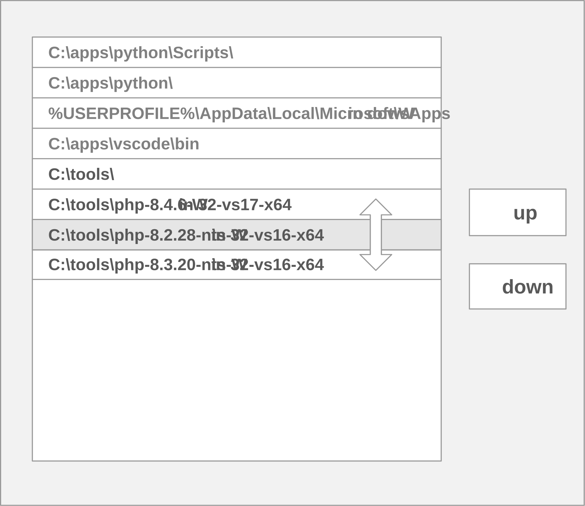

# run todo PHP server locally on nginx
## required installation
you need a folder or two folders with PATH environment set to it

containing
- from nginx download:
    - nginx.exe
- from PHP download:
    - php-cgi.exe
    - php.ini (altered copy of php.ini-development)
    - php8ts.dll or php8.dll
    - ext/php_openssl.dll

### adapt php.ini
- enable openssl:
``extension=./ext/php_openssl.dll``
- set session save path, e.g:
``session.save_path = "N;C:/PHP_SESSIONS"``

## start, state, stop
than in this ngnix folder
- call start.cmd to start the server
- open [localhost:8080](http://localhost:8080) in your browser

- call state.cmd to see if running, there should at least be an instance of
    - nginx.exe
    - php-cgi.exe

- call stop.cmd to stop

## run with different php versions
- have several php distributions in separate folders
```
C:\tools
├── nginx.exe
├── php-8.2.28-nts-Win32-vs16-x64
├── php-8.3.20-nts-Win32-vs16-x64
├── php-8.4.6-Win32-vs17-x64
```
- adapt path order before launching start script



- when launching from VS code you might have to restart VS code in order to apply path changes.
